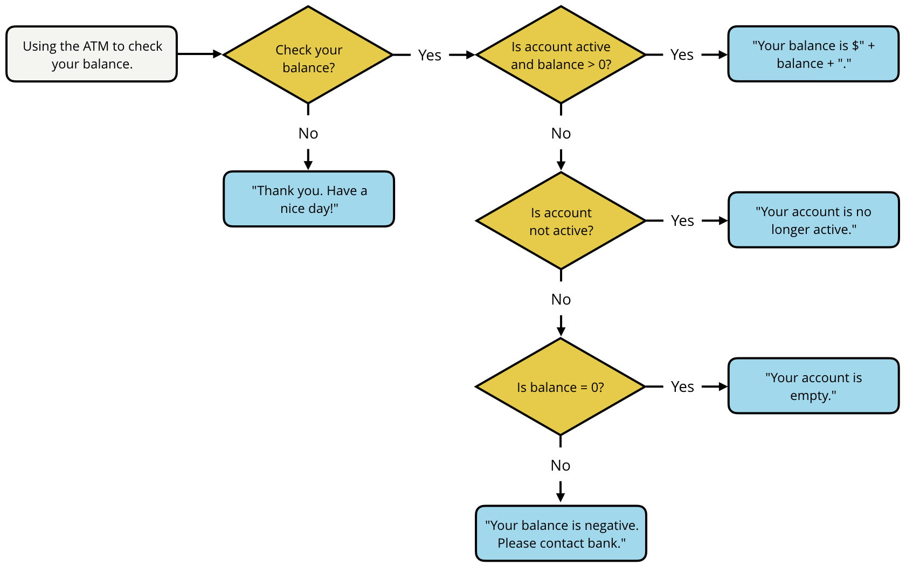

# Checking your balance

Usando el diagrama de flujo de abajo, escribe el código para representar la comprobación del saldo en el cajero automático. 

Los rombos amarillos representan declaraciones condicionales y los rectángulos azules con esquinas redondeadas representan lo que debe ser impreso en la consola.

Utiliza las siguientes variables en su solución:

- **balance** - el saldo de la cuenta
- **isActive** - si la cuenta está activa
- **checkBalance** - si quieres comprobar el saldo

[Back](../../readme.md)